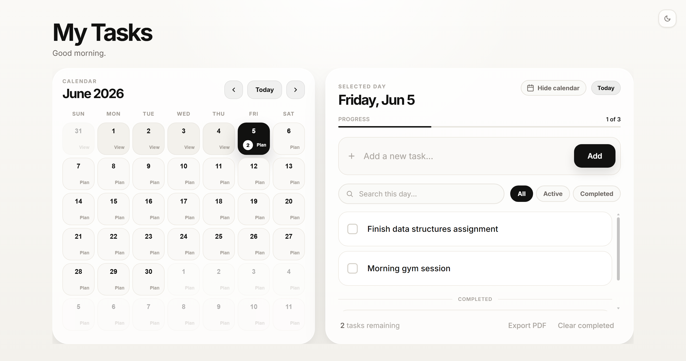

# My Tasks Calendar

A clean, minimal calendar-based task planner built with vanilla HTML, CSS, and JavaScript. Select a day, add your tasks, mark them complete, and keep track of what's left — all from a single, distraction-free calendar view.



## Features

- Calendar-first task planning
- Add tasks for today and upcoming days
- View past days in read-only mode
- Mark tasks as completed
- Remaining task count displayed on each calendar day
- Hide the calendar for a focused, full-screen task view
- Search and filter tasks within the selected day
- Export the selected day's tasks to PDF
- Internal scrolling for long task lists
- Light and dark mode
- Data saved locally using `localStorage`
- Fully responsive design

## Tech Stack

- HTML5
- CSS3
- JavaScript (ES6)
- LocalStorage

## Getting Started

No build step, installation, or backend required. Simply open the app in your browser:

```bash
index.html
```

## Project Structure

```
.
├── index.html
└── README.md
```

## Data & Privacy

Tasks are saved in the browser using `localStorage`, which means your data stays on the same browser and device. Nothing is sent to a server.
